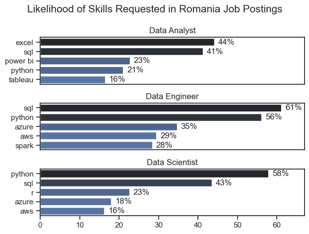
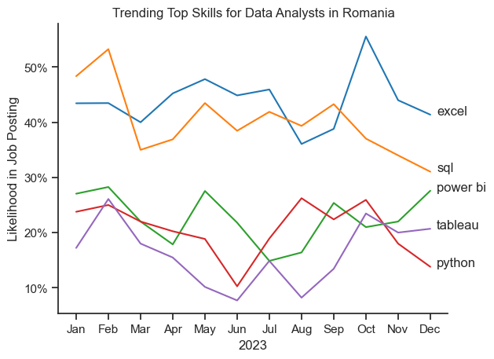
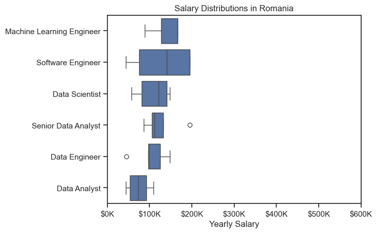
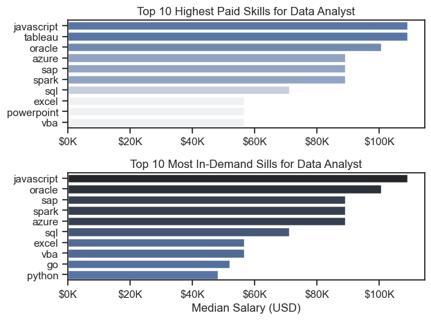
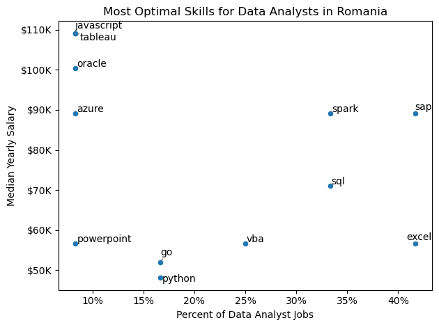

# Overview
Welcome to my analysis of the data job market, specifically targeting data analyst roles. This project stems from my desire to better understand the fundamentals of what it means to work as a data analyst, evolving my skills and deepening my knowledge of the field. By engaging with the data, even if the values may be purely fictional, I aim to practice and refine the techniques and methodologies used in data analysis. This approach allows me to build a strong foundation, improve my analytical capabilities, and prepare myself for real-world applications in the data analytics industry.

The data, sourced from [Luke Barousse's Python Course](https://www.lukebarousse.com/python), serves as the foundation for this analysis, providing comprehensive details on job titles, salaries, locations, and essential skills. Using a series of Python scripts, I address key questions such as the most in-demand skills, salary trends, and the correlation between demand and salary in the data analytics field.

# The Questions

Below are the questions I want to answer in my project:

1. What are the skills most in demand for the top 3 most popular data roles?
2. How are in-demand skills trending for Data Analysts?
3. How well do jobs and skills pay for Data Analysts?
4. What are the optimal skills for data analysts to learn? (High Demand AND High Paying)

# Tools I Used
For my deep dive into the data analyst job market, I harnessed the power of several key tools:
* **Python**: The backbone of my analysis, allowing me to analyze the data. I also used the following Python libraries:
    * **Pandas Library**: This was used to analyze the data.
    * **Matplotlib Library**: I visualized the data.
    * **Seaborn Library**: Helped me create more advanced visuals.
* **Jupyter Notebooks**: The tool I used to run my Python scripts which let me easily include my notes and analysis.
* **Visual Studio Code**

# Data Preparation and Cleanup
### Import & Clean Up Data:
I start by importing necessary libraries and loading the dataset, followed by initial data cleaning tasks to ensure data quality.
```python
# Importing Libraries
import ast
import pandas as pd
import seaborn as sns
from datasets import load_dataset
import matplotlib.pyplot as plt  

# Loading Data
dataset = load_dataset('lukebarousse/data_jobs')
df = dataset['train'].to_pandas()

# Data Cleanup
df['job_posted_date'] = pd.to_datetime(df['job_posted_date'])
df['job_skills'] = df['job_skills'].apply(lambda x: ast.literal_eval(x) if pd.notna(x) else x)
```
### Filter Romanian Jobs for Data Analyst:
```python
df_DA_RO = df[(df['job_title_short'] == 'Data Analyst') & (df['job_country'] == 'Romania')].copy()
```
# The Analysis
Each Jupyter notebook for this project aimed at investigating specific aspects of the data job market. Here are the results:


## 1. What are the most demanded skills for the top 3 most popular data roles? 

### Results:
 
*For better understanding of the code, please visit [2_Skill_Demand.ipynb](3_Project/2_Skill_Demand.ipynb)*

### Insights:
* **SQL and Python:** These are critical skills across all three roles, though their demand varies by role.
* **Excel and Power BI:** More important for Data Analysts, emphasizing data handling and visualization.
* **Cloud Computing (Azure and AWS):** Particularly important for Data Engineers, but also relevant for Data Scientists.
* **Big Data (Spark):** Significant for Data Engineers, reflecting the role's focus on large-scale data processing.
* **R:** Specific to Data Scientists, supporting statistical and data analysis tasks.


## 2. How are in-demand skills trending for Data Analysts? 

### Results:
 
*For better understanding of the code, please visit [3_Skill_Trend.ipynb](3_Project/3_Skill_Trend.ipynb)*

### Insights:
* **High Demand Skills:** Excel and SQL are consistently the most requested skills for Data Analysts in Romania, highlighting their importance in the field.
* **Moderate Demand Skills:** Power BI and Python have moderate demand, with Python showing more variability.
* **Low Demand Skill:** Tableau is the least requested skill but shows a slight increase towards the end of the year.


## 3. How well do jobs and skills pay for Data Analysts?

### Results:
### > Salary Distribution
 
*For better understanding of the code, please visit [4_Salary_Analysis.ipynb](3_Project/4_Salary_Analysis.ipynb)*

### > Highest Paid Skills and Most In-Demand for Data Analysts
 
*For better understanding of the code, please visit [4_Salary_Analysis.ipynb](3_Project/4_Salary_Analysis.ipynb)*

### Insights:
### > Salary Distribution
- **High Earning Roles:** Machine Learning Engineers and Software Engineers have the highest salary ranges, reflecting the high demand and specialized skills required.
- **Mid-Range Salaries:** Data Scientists and Senior Data Analysts have moderate to high salary ranges, indicating their crucial roles in data analysis and decision-making.
- **Entry to Mid-Level:** Data Engineers and Data Analysts have lower salary ranges compared to other roles, indicating these positions may be entry to mid-level in the career hierarchy.

### > Highest Paid Skills and Most In-Demand for Data Analysts
- **JavaScript Dominance:** JavaScript is the highest paid and most in-demand skill for data analysts, indicating its critical role in the field. Its versatility in both data visualization and web development might contribute to this trend.
- **Emerging Skills:** Skills like Go and Python appear in the most in-demand list but are not among the highest paid. This suggests these skills are gaining traction and might lead to higher salaries in the future as demand increases.
- **Specialized Tools:** Tableau and PowerPoint, which are more specialized tools, are among the highest paid skills but not in the most in-demand list, indicating that while fewer roles require these skills, they pay well when they do.
- **Traditional Skills:** Excel and VBA, traditional tools for data analysis, remain relevant both in terms of demand and pay, though their salaries are relatively lower compared to newer technologies like JavaScript and Oracle.


## 4. What are the optimal skills to learn for Data Analysts?

### Results:
 
*For better understanding of the code, please visit [5_Optimal_Skills.ipynb](3_Project/5_Optimal_Skills.ipynb)*

### Insights:
- **Optimal Skills for High Earnings:** Specializing in JavaScript, Tableau, Oracle, and Azure can lead to higher earnings, albeit with fewer job opportunities. These skills are beneficial for data analysts aiming for top-tier salaries.
- **Essential Skills for Job Security:** Skills like Excel, SQL, and VBA, while offering moderate salaries, are in high demand, providing job security and a steady career path.


# Conclusion:
Through this analysis of the data job market, specifically targeting data analyst roles, I have gained valuable insights into the skills and trends that shape the industry.

This project has been instrumental in evolving my skills and deepening my knowledge of the data analytics field. By engaging with the data, I have practiced and refined key techniques and methodologies, building a strong foundation for real-world applications.